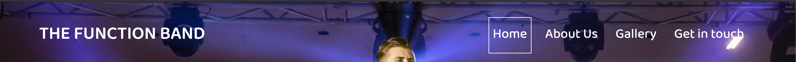
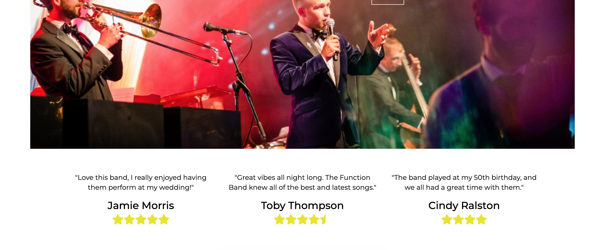
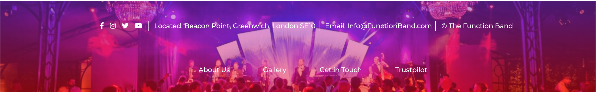
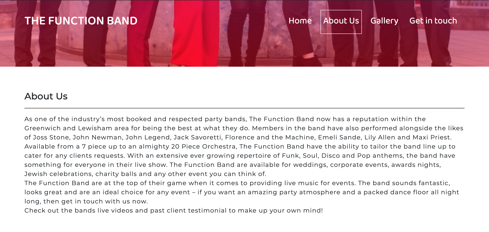
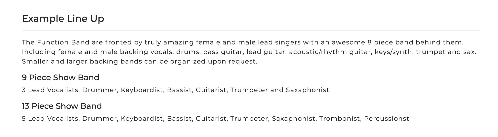
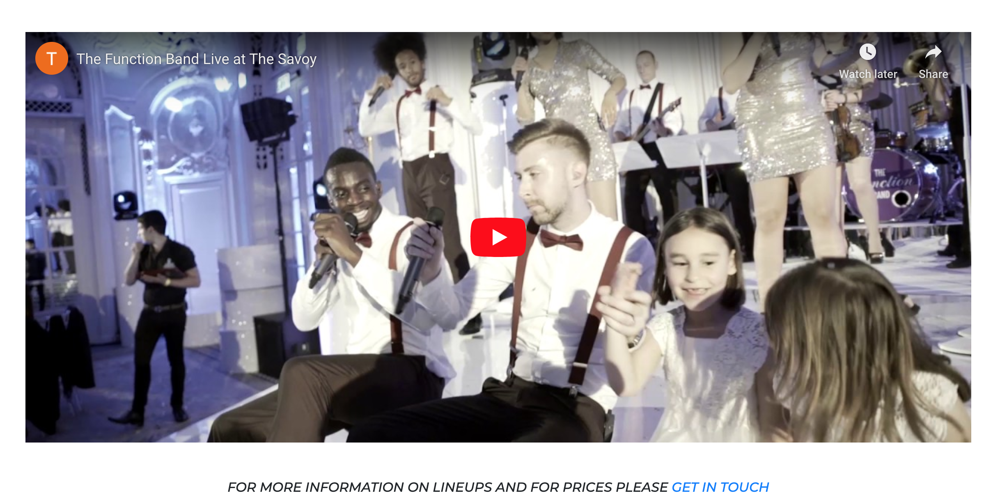
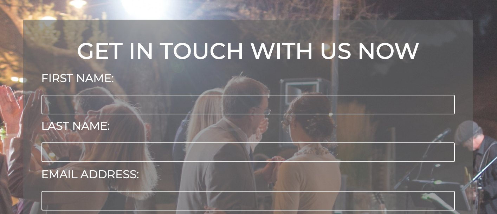
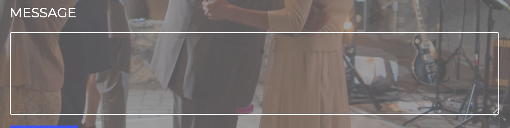

# The Function Band

### Table of Contents
1. [Introduction](#intro)
2. [User Stories](#userstory)
3. [Features](#features)

Milestone Project #1 - User Centeric Frontend Development 

The Function band is the most respected and hired band in the Greenwich and Lewisham area. This site provides deep insight into the bands style for new and past users to experience the band from the comfort of their mobile or computer. This site is to introduce the band to prospective event creators who require a band with a variety in style and performance. This site will provide information on the bands formation, background and history of the members, gallery of photos and a video of a past performance. Users will be able to read tesitimonials of the bands previous customers as well as further enquire on the bands availability and pricing information. 

The sites purpose if to allow more traffic into the site. With links to social media accounts and review sites such as Trustpilot, new and past users will not be able to quickly and easily get in touch with the band at their convenience for their event queries. The band is currently local to the Greenwich and Lewisham area, but the band would like to expand further into London and potentially throughout the UK.

## UX 

### User Stories

As a user, I want to be able to easily navigate the site, so that I can get to the page I need. 

As a user, I want to read an introduction of the band before further entering the site, so that I get an impression of the band first. 

As a user, I want to view reviews from previous customers, so that I can determine if the band is worth hiring. 

As a user, I want to access social media accounts, so that I can review their social media. 

As a user, I need to read about the bands formation, so that I have more knowledge of the band
As a user, I want to read about the bands different styles, so I know if the band is suitable for my event

As a user, I want to know the bands pricing, so I know if the band is affordable for my event

As a user, I want to listen/watch a video of the band performing, so that I like the sound of the band

As a user, I want to view photos, so that I can determine if I like the look of the band

As a user, I want to supply my contact information so that the band can get back in touch with me 

As a user, I want to write a description of the event, so that I can provide in detail of what I am expecting for the band

As a user, I want to submit the form once completed, so that the band can get back in touch

As a user, I want to know if my form has been submitted successfully, for peace of mind 

## Features 

### Existing Features

1. Users are able to navigate the site to the additional pages
2. A call to action button that links directly to the Get in Touch page
3. A link to the trustpilot review site, which allows users to read and write reviews of the band
4. Links to the bands social media accounts - users are able to follow and keep up to date with latest news and music from the band
5. A video of the bands past performance
6. A call to action link to enourage users to get in touch for pricing information 
7. A series of images of the band and past events
8. Contact form for users to submit details of themselves and event
9. A button allowing users to submit form once completed

### Features Left to Implement

In the future, I would like to implement the following:
I would have like to added more details in the About Page on individual band members and photos of each of the members. 
I would have liked to made the About Page more complex in style. 
I would like to have made the site more interactive.

## Technologies Used

1. HTML
2. CSS
3. Bootstrap

Mentions:
Font Awesome
Google Fonts

## Testing

I believe the overall site has achieved the intended purposes designed for the user stories. Users are able to easily navigate through the site to the additional pages. There are clear call to actions that encourages users to direct straight to the Get in Touch section. The images and content provide clear information of the bands style and formation as well as a likeability factor. 

1. Navigation Tool: 
    1. 'The Function Band' logo directs back to the Home Page
    2. Each of the links work appropriatly and directs to the correct pages
    3. The box over the active pages hovers over the correct and active pages

2. Home page - call to action
    1. Clicking the Enquire Now! button re-directs to the Get in Touch page
    2. The page does not open in a new tab - re-directs instead

3. Responsiveness:
    1. Each of the pages are responsive - using the Google Inspect tool 
        1. I selected each of the pages and amended the width on the Responsive mobile tool
    2. Deployed site is accessible on Google Chrome
    3. Deployed site is accessible on Samsung Galaxy 9 plus, Google Pixel 2 and Iphone X. 

4. Video Feature: 
    1. Clicking the play button on video plays video
    2. Video ends and does not replay
    3. Video is able to be played on mobile devices

5. Social Links:
    1. Selects Facebook icon and Facebook opens in a new tab
    2. Selects Instagram icon and Instagram opens in a new tab
    3. Selects Twitter icon and Twitter opens in a new tab
    4. Selects Youtube icon and Youtube opens in a new tab

6. Footer Navigation:
    1. Selects About Us and opens page in a new tab
    2. Selects Gallery and opens in a new tab
    3. Selects Get in Touch and opens in a new tab
    4. Selects Trustpilot and opens into the Trustpilot site
    5. These steps are repeated on each of the sites footers

7. Form: 
    1. Submit form with no information - unable to do so without first and last name and email
    2. Enter only First name and submit form - unable to do so without Last name and email details
    3. Enter only Last name and submit form - unable to do so without First name and email details
    4. Enter only email and submit form - unable to do so without first and last name details
    5. Enter First and Last name and partial email detail (no @) and then submit form - unable to do so without the @ icon to complete email address
    6. Enter Name and email correctly and submit form - details have been submitted correctly and page is re-directed to form submission confirmation
    7. Message box - able to increase height of box and min and max height rule is implemented
    8. Form is able to submit successfully with and without text within the message box
    9. If the message exceeds the height, users are able to scroll to the top and bottom of their message

Issues Found: 
1. When site is opened on Safari, gallery width is larger than what is supposed to be - one of the images are out of line and skewed to the right
2. When submitting form on the deployed site on a mobile device, users recieve a 405 Not Allowed error after submitting the form correctly

## Deployment

The site has been deployed using Github Pages, which is deployed directly from my Master branch. 
The deployed site automically updates after every new commit to the master branch. 

## Credits

### Content

A majority of the written content has not been written by me. The content has been sourced from other function band sites.

- The introduction text on the Home Page has been copied from the band the Brand New Groove's contact page:
https://www.brandnewgroove.co.uk/

- The text in the box when entering the About Us page was sourced from The Blue Rinse about us section:
https://www.thebluerinse.co.uk/

- The main set of text on the About Us page was sourced from the Ambassadro Band's about us section:
http://www.ambassadorband.co.uk/party-band-london/

- The example line up within the About Us page was sourced from The Function Band's site under the Showband page:
https://www.thefunction.band/showband

- The video within the About Us section was sourced from Youtube. The original performers are with The Function Band:
https://youtu.be/nNy0-O26NIQ - "The Function Band Live at The Savoy"

The code is original to me, however I have gained inspiration from previous mini projects that were compelted with Code Institute: 

The Love Running Project - This was as a mini project with guided instructions from Code Institute:
https://repl.it/@AprilHa/Love-Running

The Resume Project - This mini project with the use of Bootstrap 4 was a guided instructed series from Code Institute. I've outlined in my comments in which features I have gained inspiration in my code from. 

### Media
The photos within the project are not of my own, but were sourced from other band sites:

The Function Band's website [here](https://www.thefunction.band/)
- [Main Hero Image](https://images.squarespace-cdn.com/content/v1/58d927b186e6c087a944d4f0/1551273156885-H99PLZ3XWKYPYA92IOZA/ke17ZwdGBToddI8pDm48kCe3HEdn2TSMtiXeWGlxJwd7gQa3H78H3Y0txjaiv_0fDoOvxcdMmMKkDsyUqMSsMWxHk725yiiHCCLfrh8O1z5QPOohDIaIeljMHgDF5CVlOqpeNLcJ80NK65_fV7S1UYFM-v7jO0lurWrFubDiCW1NijbNUFECuZdfCfLpA8xjKknLkM0U3gruWGsBhc5_tQ/36_509A3987.jpg?format=2500w)

The Mini Big Band's website [here](http://www.theminibigband.co.uk/gallery/)
- [Couple Dancing](http://www.theminibigband.co.uk/mbigb-news/wp-content/uploads/2018/07/cropped-Anniversaire-Jaeggi_web-311.jpg)
- [Event Hall](http://www.theminibigband.co.uk/mbigb-news/wp-content/uploads/2017/09/Anna-and-James-958-1200x800.jpg)
- [Singer](http://www.theminibigband.co.uk/mbigb-news/wp-content/uploads/2017/09/Anna-and-James-985-1200x800.jpg)
- [Trumpet Players](http://www.theminibigband.co.uk/mbigb-news/wp-content/uploads/2014/07/minibig-p.jpg)

The London Function Band's website [here](https://thelondonfunctionband.com/)
- [Gutarist](https://thelondonfunctionband.com/sites/default/files/styles/photo_page_mobile_2x/public/2019/kimpton-fitzroy/The_London_Function_Band_Kimpton_Fitzroy_7.jpg?itok=Kl5V7Kah&timestamp=1562852073)
- [Band after performance](https://thelondonfunctionband.com/sites/default/files/2018/alice-and-james-2018/7-piece-wedding-band-hertfordshire.jpg)
- [Lead Singer](https://www.thelondonfunctionband.com/sites/default/files/styles/picture_text_blockbreakpoints_theme_lfb_mobile_2x/public/picturetextblock/lead-singer/lead-singer.jpg?itok=qgP6ceGt&timestamp=1578925082)

Central Avenue Function Band's website [here](https://www.centralavenuefunctionband.com/)
- [Backup Singers](https://www.centralavenuefunctionband.com/wp-content/uploads/2019/08/home-bnr.jpg)
- [Full Band](https://www.entertainersworldwide.com/graphics/products/cache/s_1200_800_4aa05b6a9a8363bbe6a4b8c6ef197179.jpg)

Misc Images Found on Google Images:
- [Texture](https://image.freepik.com/free-photo/cement-wall-texture-background_76539-221.jpg)

### Acknowledgements

The inspiration for this project has been from the official The Function Band's website. I recieved a majority of the color palette, content as well as videos and images from this website.
https://www.thefunction.band/

As this is my first site that I have developed from start to finish, I found that generating the commit messages to Github were difficult for me to compose correctly. This guide from Joel Parker Henderson on Github cleared my understanding of how to write clear and consise commit messages. 
https://github.com/joelparkerhenderson/git_commit_message

